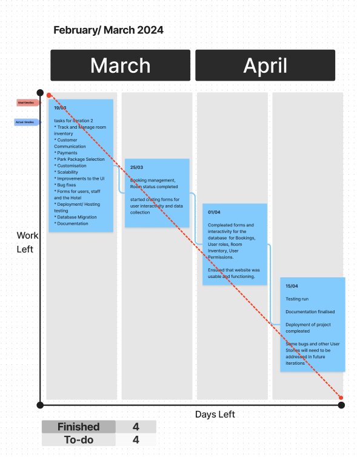

# Actual iteration-2 18/03/2024 to 11/04/2024

## Checklist:

1. GitHub entry timestamps
2. User stories are correct

## Velocity Estimation:
* Assumed Velocity FROM iteration-1: 64
* Number of developers: 4
* Total estimated amount of work: 30 days

## User stories or tasks:

1. [Customer Communication](./user_stories/user_story_customer_communication.md)
2. [Payments](./user_stories/user_stories_payments.md)
3. [Park Package Selection](./user_stories/user_story_park_package.md)
4. [Customisation](./user_stories/user_story_customisation.md)
5. [Scalability](./user_stories/user_story_scalability.md)
6. Improvements to the UI
7. Bug fixes
8. Forms for users, staff and the Hotel
9. Deployment/ Hosting testing
10. Database Migration
11. Documentation

## In progress:

* Improvements to the UI
* Park Package Selection
* Customer Communication
* Scalability

## Completed:

* Booking management
* Payments
* Room inventory
* Room status updates
* User roles and permissions for Hotel Staff and Guests
* Deployment / Hosting 
* Testing

## Burn Down for iteration-2:

Update this at least once per week

* 4 weeks left, 30 days of estimated amount of work
* 2 weeks left, 25 days
* 1 week left, 20 days
* 0 weeks left, 10 days
* Actual Velocity: 67

## User stories and tasks for future iterations

* Customer Communication
* Park Package Selection
* Improvements to the UI
* Bug fixes
* Customisation